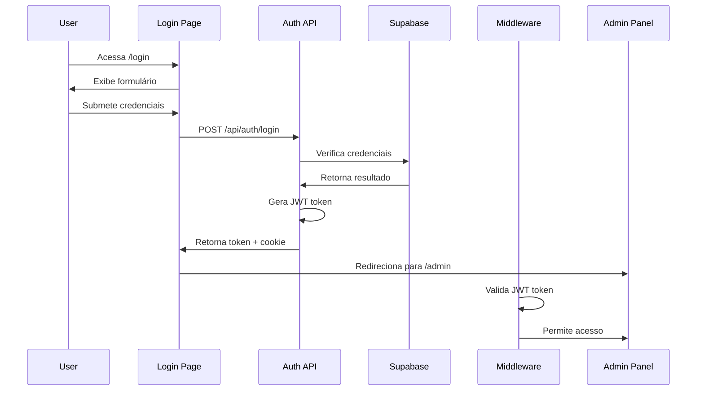
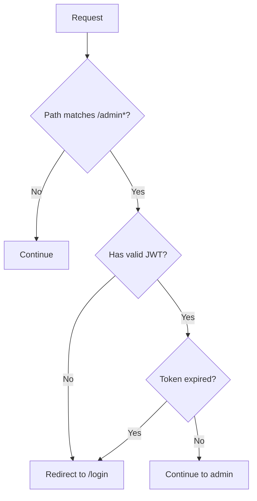

# Design Document - Sistema de Autenticação

## Overview

O sistema de autenticação será implementado usando Next.js 15 com App Router, integrando-se ao Supabase existente para armazenamento de dados. A arquitetura seguirá o padrão de autenticação JWT com middleware de proteção de rotas, implementando múltiplas camadas de segurança.

### Tecnologias Principais
- **Next.js 15** com App Router para roteamento e middleware
- **Supabase** para armazenamento de usuários e sessões
- **bcryptjs** para hashing de senhas
- **jose** para manipulação de JWT tokens
- **TypeScript** para type safety
- **TailwindCSS** para estilização
- **React Hook Form** para gerenciamento de formulários

## Architecture

### Fluxo de Autenticação



### Estrutura de Middleware



## Components and Interfaces

### 1. Authentication Context
```typescript
interface AuthContextType {
  user: User | null;
  login: (username: string, password: string) => Promise<void>;
  logout: () => void;
  isLoading: boolean;
  isAuthenticated: boolean;
}
```

### 2. User Interface
```typescript
interface User {
  id: string;
  username: string;
  role: 'admin';
  created_at: string;
  last_login: string;
}
```

### 3. JWT Payload
```typescript
interface JWTPayload {
  sub: string; // user id
  username: string;
  role: string;
  iat: number;
  exp: number;
}
```

### 4. Login Form Data
```typescript
interface LoginFormData {
  username: string;
  password: string;
}
```

## Data Models

### Users Table (Supabase)
```sql
CREATE TABLE auth_users (
  id UUID PRIMARY KEY DEFAULT gen_random_uuid(),
  username VARCHAR(50) UNIQUE NOT NULL,
  password_hash TEXT NOT NULL,
  role VARCHAR(20) DEFAULT 'admin',
  created_at TIMESTAMP WITH TIME ZONE DEFAULT NOW(),
  last_login TIMESTAMP WITH TIME ZONE,
  failed_attempts INTEGER DEFAULT 0,
  locked_until TIMESTAMP WITH TIME ZONE,
  updated_at TIMESTAMP WITH TIME ZONE DEFAULT NOW()
);
```

### Sessions Table (Opcional - para invalidação de tokens)
```sql
CREATE TABLE auth_sessions (
  id UUID PRIMARY KEY DEFAULT gen_random_uuid(),
  user_id UUID REFERENCES auth_users(id) ON DELETE CASCADE,
  token_jti VARCHAR(255) UNIQUE NOT NULL,
  expires_at TIMESTAMP WITH TIME ZONE NOT NULL,
  created_at TIMESTAMP WITH TIME ZONE DEFAULT NOW()
);
```

## Error Handling

### 1. Authentication Errors
- **Invalid Credentials**: Mensagem genérica "Credenciais inválidas"
- **Account Locked**: "Conta temporariamente bloqueada"
- **Token Expired**: Redirecionamento automático para login
- **Token Invalid**: Limpeza de cookies e redirecionamento

### 2. Rate Limiting
- **IP-based limiting**: 5 tentativas por 15 minutos
- **Account-based limiting**: 3 tentativas consecutivas = bloqueio por 30 minutos
- **Progressive delays**: Aumento exponencial do tempo entre tentativas

### 3. Error Logging
```typescript
interface SecurityEvent {
  type: 'login_attempt' | 'login_success' | 'login_failure' | 'token_invalid';
  user_id?: string;
  ip_address: string;
  user_agent: string;
  timestamp: Date;
  details?: Record<string, any>;
}
```

## Testing Strategy

### 1. Unit Tests
- **Password hashing/verification**
- **JWT token generation/validation**
- **Form validation logic**
- **Rate limiting functions**

### 2. Integration Tests
- **Login flow end-to-end**
- **Route protection middleware**
- **Session management**
- **Logout functionality**

### 3. Security Tests
- **SQL injection attempts**
- **XSS prevention**
- **CSRF protection**
- **Rate limiting effectiveness**
- **Token manipulation attempts**

### 4. E2E Tests
- **Complete authentication flow**
- **Route protection scenarios**
- **Mobile responsiveness**
- **Error handling scenarios**

## Security Considerations

### 1. Password Security
- **bcrypt** com salt rounds = 12
- Validação de força de senha (mínimo 8 caracteres)
- Prevenção de senhas comuns

### 2. JWT Security
- **HS256** algorithm com chave secreta robusta
- Expiração curta (1 hora) com refresh opcional
- Payload mínimo (apenas dados essenciais)
- HttpOnly cookies para armazenamento

### 3. CSRF Protection
- **SameSite=Strict** cookies
- CSRF tokens em formulários
- Validação de origin headers

### 4. Rate Limiting
- **IP-based** e **account-based** limiting
- Headers informativos (X-RateLimit-*)
- Logging de tentativas suspeitas

### 5. HTTPS Enforcement
- Redirecionamento automático em produção
- Secure cookies apenas em HTTPS
- HSTS headers

## Configuration

### Environment Variables
```bash
# JWT Configuration
JWT_SECRET=your-super-secret-jwt-key-here
JWT_EXPIRES_IN=1h

# Rate Limiting
RATE_LIMIT_MAX_ATTEMPTS=5
RATE_LIMIT_WINDOW_MS=900000  # 15 minutes
ACCOUNT_LOCK_DURATION_MS=1800000  # 30 minutes

# Security
BCRYPT_ROUNDS=12
CSRF_SECRET=your-csrf-secret-here

# Supabase (existing)
NEXT_PUBLIC_SUPABASE_URL=...
NEXT_PUBLIC_SUPABASE_ANON_KEY=...
SUPABASE_SERVICE_ROLE_KEY=...
```

### Default Admin User
- **Username**: admin
- **Password**: Gerada aleatoriamente na primeira execução
- **Exibida no console** durante setup inicial
- **Deve ser alterada** no primeiro login

## File Structure

```
src/
├── app/
│   ├── login/
│   │   └── page.tsx
│   ├── api/
│   │   └── auth/
│   │       ├── login/route.ts
│   │       ├── logout/route.ts
│   │       └── verify/route.ts
│   └── admin/
│       └── (protected routes)
├── components/
│   └── auth/
│       ├── LoginForm.tsx
│       └── AuthProvider.tsx
├── lib/
│   ├── auth/
│   │   ├── jwt.ts
│   │   ├── password.ts
│   │   ├── rateLimit.ts
│   │   └── middleware.ts
│   └── supabase/
│       └── auth.ts
├── middleware.ts
└── types/
    └── auth.ts
```

## Performance Considerations

### 1. Caching Strategy
- **JWT verification**: Cache de chaves públicas
- **Rate limiting**: Redis ou in-memory cache
- **User data**: Cache de sessão com TTL

### 2. Database Optimization
- **Indexes**: username, token_jti, expires_at
- **Connection pooling**: Supabase built-in
- **Query optimization**: Prepared statements

### 3. Client-side Optimization
- **Code splitting**: Lazy loading de componentes auth
- **Bundle size**: Tree shaking de dependências
- **Hydration**: SSR para página de login