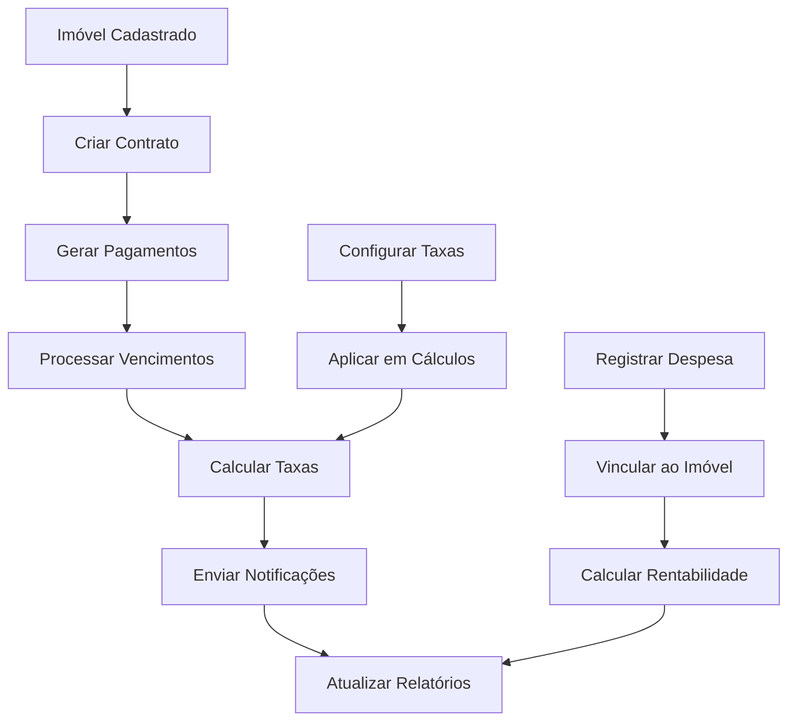

# Sistema de Controle de Aluguéis e Finanças

## Visão Geral

O Sistema de Controle de Aluguéis e Finanças é um módulo completo integrado à plataforma de gestão imobiliária que permite o controle total dos aspectos financeiros relacionados aos aluguéis de imóveis. O sistema oferece funcionalidades para gestão de contratos, controle de pagamentos, gestão de despesas, geração de relatórios e automação de processos financeiros.

## Funcionalidades Principais

### 1. Gestão de Contratos de Aluguel

#### Criação e Edição de Contratos
- **Vinculação automática** com imóveis e clientes cadastrados
- **Configuração flexível** de valores, datas e condições
- **Geração automática** de pagamentos mensais
- **Controle de status** (ativo, encerrado, suspenso)
- **Histórico completo** de alterações

#### Funcionalidades Disponíveis:
- ✅ Criar novos contratos
- ✅ Editar contratos existentes
- ✅ Visualizar detalhes completos
- ✅ Encerrar contratos
- ✅ Gerar pagamentos automáticos
- ✅ Controle de vencimentos

### 2. Controle de Pagamentos

#### Gestão de Recebimentos
- **Registro manual** ou automático de pagamentos
- **Cálculo automático** de juros e multas
- **Controle de inadimplência** com alertas
- **Calendário visual** de vencimentos
- **Processamento em lote** de vencimentos

#### Status de Pagamentos:
- **Pendente**: Aguardando pagamento
- **Pago**: Pagamento confirmado
- **Atrasado**: Vencido com cálculo de taxas
- **Cancelado**: Cancelado por encerramento de contrato

### 3. Gestão de Despesas

#### Controle de Custos por Imóvel
- **Categorização** de despesas (manutenção, impostos, seguros, etc.)
- **Vinculação** direta com imóveis
- **Controle de status** de pagamento
- **Cálculo de impacto** na rentabilidade

#### Categorias de Despesas:
- 🔧 **Manutenção**: Reparos e conservação
- 📋 **Impostos**: IPTU, taxas municipais
- 🛡️ **Seguros**: Seguro predial, incêndio
- 🏢 **Administração**: Taxas de administração
- 📦 **Outros**: Despesas diversas

### 4. Relatórios Financeiros

#### Relatórios Disponíveis

##### Relatório Financeiro Mensal
- **Receitas totais** do período
- **Despesas por categoria**
- **Lucro líquido** calculado
- **Indicadores de performance**
- **Comparativo mensal**

##### Relatório de Inadimplência
- **Lista detalhada** de pagamentos em atraso
- **Análise de aging** (30, 60, 90+ dias)
- **Valores totais** em atraso
- **Histórico de inadimplência**

##### Relatório de Rentabilidade por Imóvel
- **Receita bruta** por propriedade
- **Despesas associadas**
- **Margem de lucro** individual
- **Comparativo de performance**
- **ROI (Return on Investment)**

#### Exportação de Dados
- 📄 **PDF**: Relatórios formatados para impressão
- 📊 **Excel**: Dados para análise avançada
- 📈 **Gráficos**: Visualizações interativas

### 5. Configurações Financeiras

#### Parâmetros Configuráveis
- **Taxa de juros mensal**: Para pagamentos em atraso
- **Taxa de multa**: Percentual fixo por atraso
- **Dias de carência**: Prazo antes de aplicar taxas
- **Taxa de comissão**: Para cálculos de comissão

#### Valores Padrão:
- Taxa de juros: 1% ao mês
- Taxa de multa: 2% sobre o valor
- Dias de carência: 5 dias
- Taxa de comissão: 10%

### 6. Sistema de Notificações

#### Alertas Automáticos
- **Vencimentos próximos**: 3 dias antes do vencimento
- **Pagamentos em atraso**: Notificação imediata
- **Contratos vencendo**: 30 dias antes do fim
- **Lembretes periódicos**: Para inadimplentes

#### Canais de Notificação:
- 📧 **Email**: Notificações por email
- 📱 **Sistema**: Alertas na plataforma
- 📊 **Dashboard**: Indicadores visuais

## Arquitetura Técnica

### Estrutura do Banco de Dados

#### Tabelas Principais

```sql
-- Contratos de Aluguel
contratos_aluguel (
  id UUID PRIMARY KEY,
  imovel_id UUID REFERENCES imoveis(id),
  inquilino_id UUID REFERENCES clientes(id),
  valor_aluguel DECIMAL(10,2),
  data_inicio DATE,
  data_fim DATE,
  status VARCHAR(20),
  -- outros campos...
)

-- Pagamentos de Aluguel
pagamentos_aluguel (
  id UUID PRIMARY KEY,
  contrato_id UUID REFERENCES contratos_aluguel(id),
  mes_referencia DATE,
  valor_devido DECIMAL(10,2),
  valor_pago DECIMAL(10,2),
  status VARCHAR(20),
  -- outros campos...
)

-- Despesas dos Imóveis
despesas_imoveis (
  id UUID PRIMARY KEY,
  imovel_id UUID REFERENCES imoveis(id),
  categoria VARCHAR(50),
  valor DECIMAL(10,2),
  data_despesa DATE,
  status VARCHAR(20),
  -- outros campos...
)

-- Configurações Financeiras
configuracoes_financeiras (
  id UUID PRIMARY KEY,
  taxa_juros_mensal DECIMAL(5,4),
  taxa_multa DECIMAL(5,4),
  taxa_comissao DECIMAL(5,4),
  dias_carencia INTEGER,
  -- outros campos...
)
```

### APIs Disponíveis

#### Contratos
- `GET /api/contratos` - Listar contratos
- `POST /api/contratos` - Criar contrato
- `GET /api/contratos/[id]` - Detalhes do contrato
- `PUT /api/contratos/[id]` - Atualizar contrato
- `DELETE /api/contratos/[id]` - Encerrar contrato

#### Pagamentos
- `GET /api/pagamentos` - Listar pagamentos
- `POST /api/pagamentos` - Registrar pagamento
- `PUT /api/pagamentos/[id]` - Atualizar pagamento
- `POST /api/pagamentos/processar-vencimentos` - Processar vencimentos

#### Despesas
- `GET /api/despesas` - Listar despesas
- `POST /api/despesas` - Registrar despesa
- `PUT /api/despesas/[id]` - Atualizar despesa
- `DELETE /api/despesas/[id]` - Remover despesa

#### Relatórios
- `GET /api/relatorios/financeiro` - Relatório financeiro
- `GET /api/relatorios/inadimplencia` - Relatório de inadimplência
- `GET /api/relatorios/rentabilidade` - Relatório de rentabilidade

#### Configurações
- `GET /api/configuracoes-financeiras` - Obter configurações
- `PUT /api/configuracoes-financeiras` - Atualizar configurações

### Componentes React

#### Estrutura de Componentes

```
src/components/admin/Financeiro/
├── Contratos/
│   ├── ContratosList.tsx      # Lista de contratos
│   ├── ContratoForm.tsx       # Formulário de contrato
│   ├── ContratoDetails.tsx    # Detalhes do contrato
│   └── ContratoStatus.tsx     # Status visual
├── Pagamentos/
│   ├── PagamentosList.tsx     # Lista de pagamentos
│   ├── PagamentoForm.tsx      # Formulário de pagamento
│   ├── CalendarioPagamentos.tsx # Calendário visual
│   └── ProcessarVencimentos.tsx # Processamento automático
├── Despesas/
│   ├── DespesasList.tsx       # Lista de despesas
│   ├── DespesaForm.tsx        # Formulário de despesa
│   └── DespesasCategoria.tsx  # Agrupamento por categoria
├── Relatorios/
│   ├── RelatorioFinanceiro.tsx    # Relatório financeiro
│   ├── RelatorioInadimplencia.tsx # Relatório de inadimplência
│   ├── RelatorioRentabilidade.tsx # Relatório de rentabilidade
│   └── ExportarRelatorio.tsx      # Exportação de dados
├── Configuracoes/
│   └── ConfiguracoesFinanceiras.tsx # Configurações do sistema
└── Common/
    ├── FinanceiroCard.tsx       # Card de informações financeiras
    ├── StatusBadge.tsx          # Badge de status visual
    └── ValorDisplay.tsx         # Exibição formatada de valores
```

### Páginas do Sistema

#### Estrutura de Páginas

```
src/app/admin/financeiro/
├── page.tsx                     # Dashboard financeiro principal
├── contratos/
│   ├── page.tsx                 # Lista de contratos
│   ├── novo/
│   │   └── page.tsx             # Formulário de novo contrato
│   └── [id]/
│       └── page.tsx             # Detalhes do contrato
├── pagamentos/
│   ├── page.tsx                 # Gestão de pagamentos
│   └── calendario/
│       └── page.tsx             # Calendário de pagamentos
├── despesas/
│   ├── page.tsx                 # Lista de despesas
│   └── nova/
│       └── page.tsx             # Formulário de nova despesa
├── relatorios/
│   ├── page.tsx                 # Seleção de relatórios
│   ├── financeiro/
│   │   └── page.tsx             # Relatório financeiro
│   ├── inadimplencia/
│   │   └── page.tsx             # Relatório de inadimplência
│   └── rentabilidade/
│       └── page.tsx             # Relatório de rentabilidade
└── configuracoes/
    └── page.tsx                 # Configurações financeiras
```

## Guia de Uso

### 1. Criando um Novo Contrato

1. **Acesse** o módulo financeiro
2. **Navegue** para "Contratos" → "Novo Contrato"
3. **Selecione** o imóvel disponível
4. **Escolha** o inquilino (cliente)
5. **Configure** valor do aluguel e datas
6. **Defina** dia de vencimento
7. **Salve** o contrato

**Resultado**: O sistema gerará automaticamente os pagamentos mensais para todo o período do contrato.

### 2. Registrando um Pagamento

1. **Acesse** "Pagamentos"
2. **Localize** o pagamento pendente
3. **Clique** em "Registrar Pagamento"
4. **Informe** valor pago e data
5. **Confirme** o registro

**Resultado**: O status será atualizado para "Pago" e o valor será contabilizado nos relatórios.

### 3. Processamento Automático de Vencimentos

O sistema executa automaticamente:

1. **Diariamente** verifica pagamentos vencidos
2. **Calcula** juros e multas conforme configuração
3. **Atualiza** status para "Atrasado"
4. **Envia** notificações automáticas
5. **Registra** logs de auditoria

### 4. Gerando Relatórios

#### Relatório Financeiro Mensal:
1. **Acesse** "Relatórios" → "Financeiro"
2. **Selecione** o período desejado
3. **Visualize** métricas e gráficos
4. **Exporte** em PDF ou Excel

#### Relatório de Inadimplência:
1. **Acesse** "Relatórios" → "Inadimplência"
2. **Analise** pagamentos em atraso
3. **Visualize** aging de recebíveis
4. **Tome** ações de cobrança

### 5. Configurando Parâmetros Financeiros

1. **Acesse** "Configurações Financeiras"
2. **Ajuste** taxas de juros e multa
3. **Configure** dias de carência
4. **Salve** as alterações

**Importante**: As alterações afetam apenas novos cálculos, não retroativos.

## Segurança e Auditoria

### Controle de Acesso

#### Perfis de Usuário:
- **Administrador**: Acesso total ao sistema
- **Corretor**: Acesso limitado aos próprios dados
- **Visualizador**: Apenas consulta de relatórios

#### Permissões por Funcionalidade:
- `financial.contracts.view` - Visualizar contratos
- `financial.contracts.create` - Criar contratos
- `financial.contracts.edit` - Editar contratos
- `financial.contracts.delete` - Encerrar contratos
- `financial.payments.view` - Visualizar pagamentos
- `financial.payments.create` - Registrar pagamentos
- `financial.reports.view` - Visualizar relatórios
- `financial.reports.export` - Exportar relatórios
- `financial.settings.edit` - Alterar configurações

### Auditoria e Logs

#### Operações Auditadas:
- ✅ Criação/edição de contratos
- ✅ Registro de pagamentos
- ✅ Alteração de configurações
- ✅ Geração de relatórios
- ✅ Tentativas de acesso negado

#### Informações Registradas:
- **Usuário** que executou a operação
- **Data e hora** da operação
- **IP** de origem
- **Dados** antes e depois da alteração
- **Resultado** da operação

### Validação de Dados

#### Validações Implementadas:
- **Valores financeiros**: Não negativos, dentro de limites
- **Datas**: Formato válido, períodos consistentes
- **UUIDs**: Formato válido, existência de referências
- **Percentuais**: Dentro de limites aceitáveis
- **Strings**: Sanitização contra XSS e SQL injection

## Integração com Sistema Existente

### Módulos Integrados

#### Imóveis:
- **Seleção** de imóveis disponíveis
- **Atualização** de status de aluguel
- **Vinculação** com despesas

#### Clientes:
- **Seleção** de inquilinos
- **Histórico** de contratos
- **Dados de contato** para notificações

#### Usuários:
- **Controle** de acesso baseado em roles
- **Auditoria** de operações por usuário
- **Isolamento** de dados por usuário

### Fluxo de Dados



## Manutenção e Monitoramento

### Tarefas Automáticas

#### Processamento Diário:
- **Verificação** de vencimentos
- **Cálculo** de juros e multas
- **Envio** de notificações
- **Atualização** de status

#### Limpeza de Dados:
- **Arquivamento** de contratos antigos
- **Compactação** de logs de auditoria
- **Backup** de dados críticos

### Monitoramento

#### Métricas Importantes:
- **Taxa de inadimplência** mensal
- **Tempo médio** de recebimento
- **Volume** de transações
- **Performance** de relatórios

#### Alertas do Sistema:
- **Falhas** no processamento automático
- **Tentativas** de acesso não autorizado
- **Erros** de validação de dados
- **Performance** degradada

## Troubleshooting

### Problemas Comuns

#### Pagamentos não processados:
1. **Verificar** configurações financeiras
2. **Validar** dados do contrato
3. **Checar** logs de erro
4. **Reprocessar** manualmente se necessário

#### Relatórios com dados incorretos:
1. **Verificar** período selecionado
2. **Validar** filtros aplicados
3. **Checar** integridade dos dados
4. **Regenerar** relatório

#### Notificações não enviadas:
1. **Verificar** configurações de email
2. **Validar** dados de contato
3. **Checar** logs de envio
4. **Testar** conectividade

### Logs e Debugging

#### Localização dos Logs:
- **Aplicação**: Console do navegador (desenvolvimento)
- **Servidor**: Logs do Supabase
- **Auditoria**: Tabela `logs_auditoria`
- **Segurança**: Logs de segurança

#### Informações Úteis:
- **Request ID**: Para rastrear requisições
- **User ID**: Para identificar usuário
- **Timestamp**: Para análise temporal
- **Stack trace**: Para erros técnicos

## Suporte e Contato

Para suporte técnico ou dúvidas sobre o sistema:

- **Documentação**: Consulte este documento
- **Logs**: Verifique os logs de auditoria
- **Testes**: Execute os testes automatizados
- **Código**: Consulte o código-fonte comentado

## Changelog

### Versão 1.0.0 (Atual)
- ✅ Gestão completa de contratos
- ✅ Controle de pagamentos
- ✅ Gestão de despesas
- ✅ Relatórios financeiros
- ✅ Sistema de notificações
- ✅ Configurações financeiras
- ✅ Integração com sistema existente
- ✅ Segurança e auditoria
- ✅ Testes automatizados
- ✅ Documentação completa

### Próximas Versões
- 📋 Dashboard executivo
- 📋 Integração com bancos
- 📋 Cobrança automática
- 📋 App mobile
- 📋 Inteligência artificial para previsões